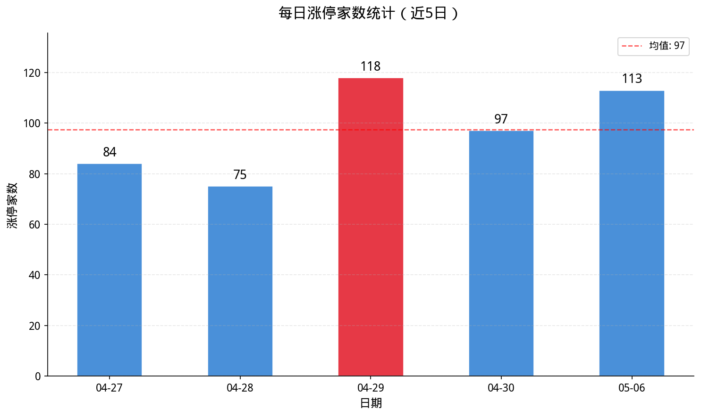
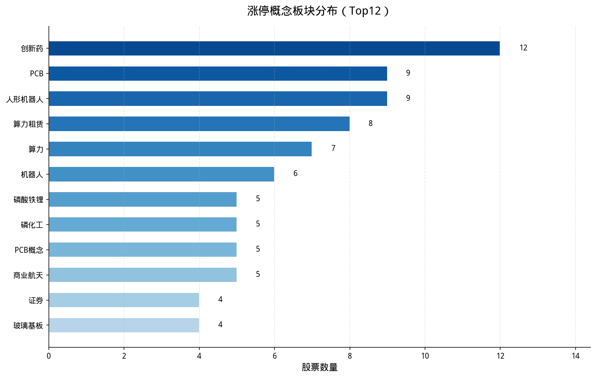
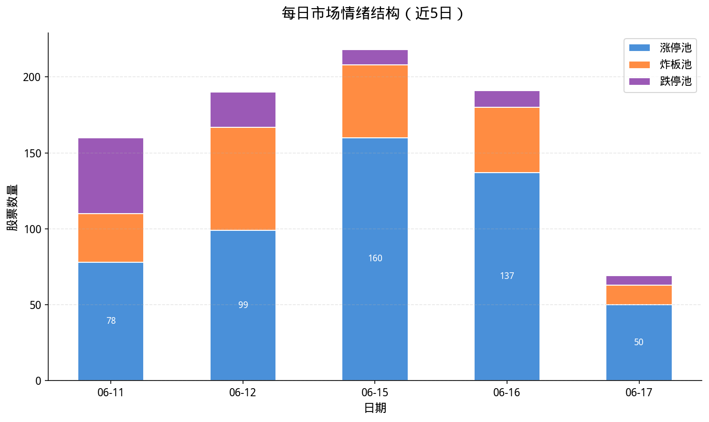
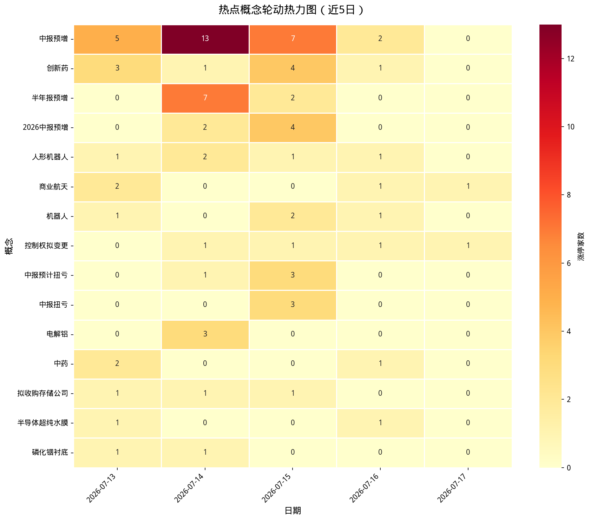
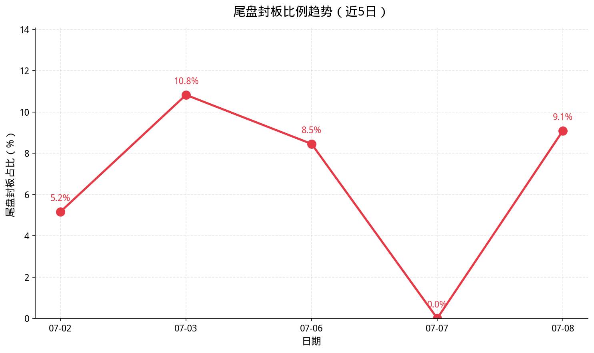
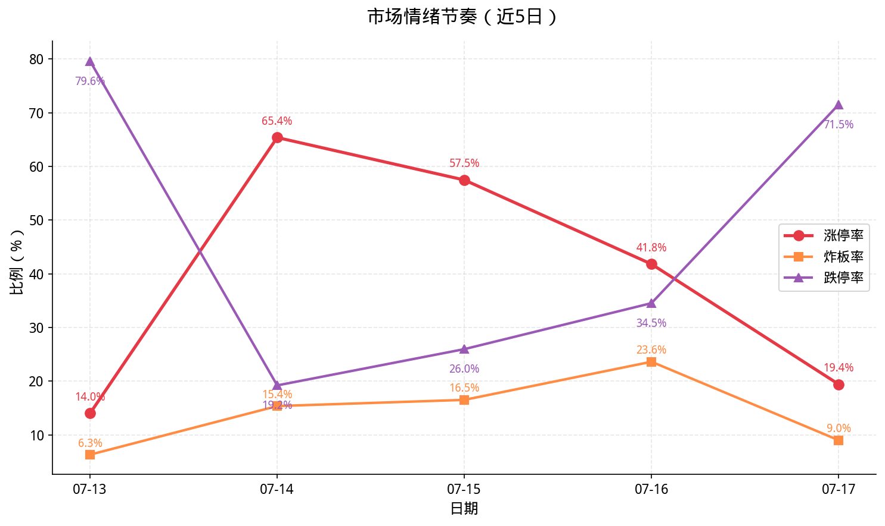

# 🚀 A股微观结构监控与量化复盘系统

这是一个集合了**实时资讯推送**与**深度量化复盘**的自动化交易辅助系统。它能洞察市场情绪波动，分析题材持续性，并帮助交易者构建“大局观”。

---

## 🧘 核心理念：量化之道
> **"大道至简，实证先行。"**
> 本系统不追求预测，而是通过统计市场微观数据（连板、炸板、跌停、风口）来呈现当下的底层逻辑，助你顺势而为。

---

## ✨ 核心功能

### 1. 📢 实时资讯中心 (财联社)
- **精准推送**：实时抓取财联社电报，通过特定关键词（如：利好、重要、突发）自动标注重要情报。
- **资讯筛选**：将重要资讯与一般资讯分离，生成每日 Markdown 电报集。
- **多端触达**：资讯内容自动推送到飞书群聊，并生成 5 日情报合集。

### 2. 📊 深度量化复盘 (同花顺数据源)
- **多维度监控**：
    - **涨停池/炸板池/跌停池**：监控短线情绪的冰点与沸点。
    - **最强风口**：识别当前市场的核心主流题材及其领涨股。
- **深度研报生成**：
    - **因果反馈分析**：计算昨日涨停今日晋级率（连板效应）。
    - **题材持续性**：通过基因比对分析主流热点是否具有持续性。
    - **连板梯队**：自动梳理非 ST 连板身位，呈现清晰的梯队逻辑。
- **禅师总结**：基于市场分位数的“禅外题话”，提供定性的情绪指引。
- **情绪可视化**：自动生成 8 张核心情绪走势图，涵盖封板强度、板块轮动及情绪节奏。

### 3. 🤖 云端自动化 (GitHub Actions)
- **全天候运行**：每 30 分钟自动执行一次，并在盘后生成最终总结。
- **历史归档**：自动生成 `.csv` 表格并归档历史数据（本地受 `.gitignore` 保护，保持仓库整洁）。

---

## 🛠️ 快速上手

### 1. 部署环境

确保已配置以下环境变量（GitHub Secrets 或本地环境）：
- `FEISHU_APP_ID`: 飞书应用 ID
- `FEISHU_APP_SECRET`: 飞书应用密钥
- `FEISHU_CHAT_ID`: 接收消息的群聊 ID
- `ENABLE_FEISHU_BOT`: 是否开启推送 (`true`/`false`)

### 2. 依赖安装

```bash
pip install requests pytz pandas matplotlib seaborn
```

### 3. 核心文件说明

| 文件名 | 作用 | 
| :--- | :--- |
| `cls_to_feishu.py` | 财联社电报抓取与飞书基础推送 |
| `market_data_fetcher.py` | **(核心)** 同花顺量化数据抓取引擎 |
| `market_data_consolidator.01.py` | **(大脑)** 整合多源数据，生成深度 MD 报告与 CSV |
| `.github/workflows/` | GitHub Actions 云端运行逻辑 |

---

## 📈 情绪可视化周报（最新）

系统每日收盘后自动更新以下微观结构看板：

| 图 1：每日涨停家数统计 | 图 2：涨停概念板块分布 |
| :--- | :--- |
|  |  |

| 图 4：每日市场情绪结构 | 图 5：热点概念轮动热力图 |
| :--- | :--- |
|  |  |

| 图 7：尾盘封板比例趋势 | 图 8：市场情绪节奏 |
| :--- | :--- |
|  |  |

> [!TIP]
> **尾盘封板比例**过高通常预示次日承接转弱；**炸板率与跌停率**的交织反映了短线博弈的惨烈程度。

---

## ⚠️ 注意事项

1. **环境依赖**：云端执行依赖 `pandas` 库，已在 Workflow 中默认配置。
2. **数据存储**：JSON 与 `output/` 原始数据默认不上传回 GitHub 仓库。
3. **定时逻辑**：GitHub Actions 的定时触发 (`cron`) 存在 5-10 分钟延迟，属于正常现象。

---

## 🧠 禅语寄语
> **"知止不殆，可以长久。"**
> 此系统仅为辅助决策，真正的交易之道在于内心的平静。亏损时能及时收手，盈利时不贪功冒进。

